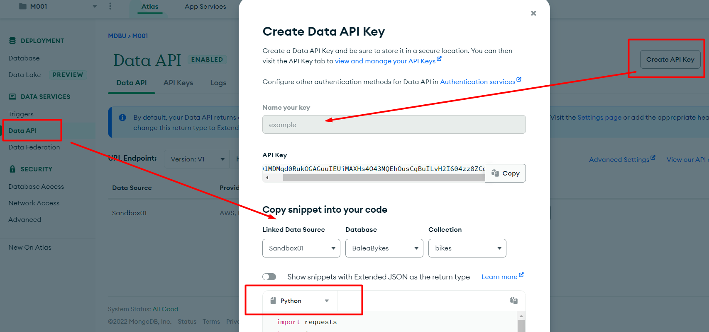
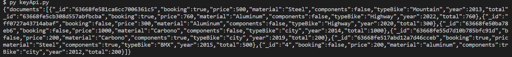
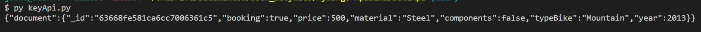
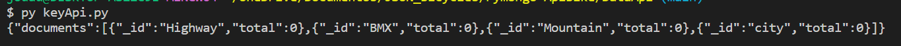
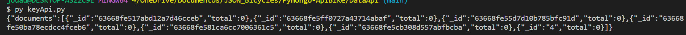

# Data Api

The objective of this project is to provide a simple and easy to use API to access data from the database
of the bikes, with a key of the mongodb atlas.

## Requeriments

- MongoDB Atlas --> For the cluster and key
- Python 3.9 --> For the code
- Maybe some libraries --> For the code
- A terminal like Git Bash --> For the code

## Process

I created one directory called DataApi, and inside of it I created a file called keyAPI.py, where I put the key of the mongodb atlas, and another file called READMEAPI.md, where I put the process and the functionality of the project. All of this files is in same project of the pymongo-apiBike.

Steps:

- Connect to the atlas web interface
- Follow the “Data API” link on the left hand side navigation bar.
- Create an API key
- Choose your database and collection
- Change cURL to Python in the dropdown menu
- Copy the python code
- Modify the code so that it prints all the fields of all the documents of your bicycles database.

## Funcionality

First of all i need a api key of the database from mongo atlas. 

I choice Python for the key, and i copy the code in the file keyAPI.py.

When i run the code, i get all the data of the database **Bicycle**.
Is important modify the *url* and change the endopoint. 
(More information in the code)

After this, i make more queries, modifying payload.

Use the **pipeline** to make more queries. (Using the endpoint aggregate)

It is important to note that it is possible to use **$match** to pass only the documents that match the specified conditions. 

But also that the database contains limited information and only six bicycles, you could also request data from different collections but in the key we only use one.

## More information

- [MongoDB Atlas](https://www.mongodb.com/cloud/atlas)
- [MongoDB Read and Write with Data API](https://www.mongodb.com/docs/atlas/api/data-api/)

