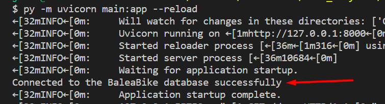
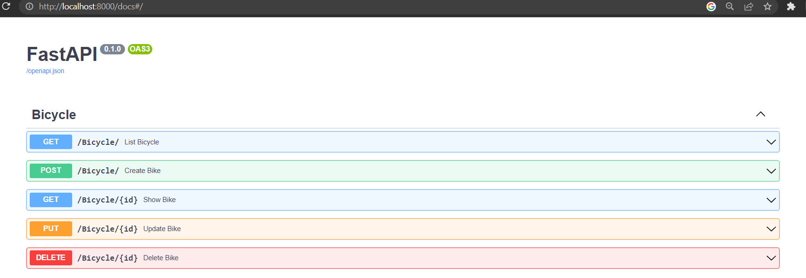
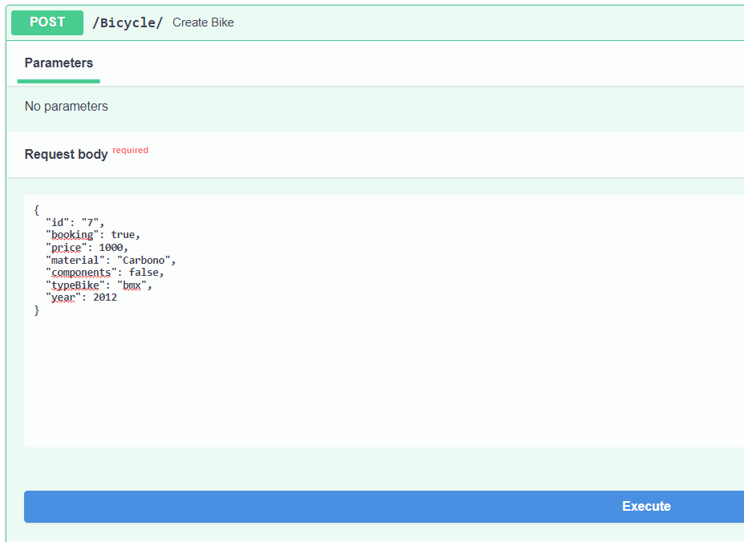
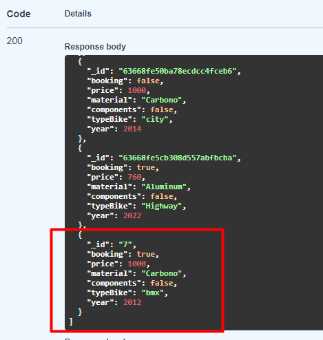

# Pymongo-ApiBike

The objective is to create a REST API with Python and MongoDB for a bike sharing system, using the FastAPI framework,
and the PyMongo library to connect to the database and perform the CRUD operations.

## Requirements

- Python 3.9
- MongoDB 4.4
- A MongoDB Atlas account with a cluster created

## Functionalities

Here is how the API works:

First of all, we need to run the server:

Then, we can go to the Swagger UI to test the API:

We can see the different endpoints and the different HTTP methods available:

Here we create a new bike:

And check that the bike has been created:

Is it possible to make all CRUD operations on the bikes.